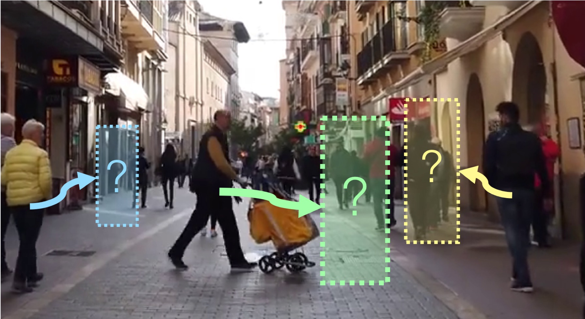
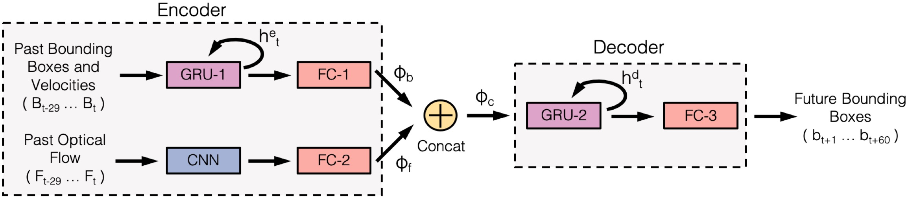

# Multiple Object Forecasting

The repo contains the Citywalks dataset and code for the paper: 

**Multiple Object Forecasting: Predicting Future Object Locations in Diverse Environments. WACV 2020.**

ArXiv paper:   https://arxiv.org/abs/1909.11944

<p align="center"> 

</p>


Content available:

- The Citywalks dataset
- Raw tracking labels
- Ground truth trajectory labels
- Metadata
- STED trajectory predictions
- Evaluation code
- STED model code

Citywalks contains a total of 501 20-second video clips of which 358 contain at least one valid pedestrian trajectory.  


# Citywalks

<p align="center"> 

</p>


## Downloading Citywalks videos
The raw videos can be downloaded here: [[Google Drive](https://drive.google.com/open?id=1oMN-fsWvEjUZ9Ah_3JwUuIY7cmR0OP_Q)] 
[[One Drive](https://1drv.ms/u/s!AlCsPcYF4WdzjGVQzrAPeteUH4rS?e=tET0GY)]

To download from the terminal:
```bash
pip install gdown
gdown https://drive.google.com/uc?id==1oMN-fsWvEjUZ9Ah_3JwUuIY7cmR0OP_Q
```
OR 
```bash
wget -O citywalks.zip "https://onedrive.live.com/download?cid=7367E105C63DAC50&resid=7367E105C63DAC50%211637&authkey=AJmkgXYpBLsX-CM"
```

## Downloading tracking results

We use Yolov3 and Mask-RCNN to detect pedestrians, and DeepSORT to track pedestrians. Tracking results can be downloaded here: [[Google Drive](https://drive.google.com/open?id=12-_FiphR5m0Yd455pem13OVnvCvi-yIn)] [[One Drive](https://onedrive.live.com/?authkey=%21AJvssSoCKvoJ2ew&cid=7367E105C63DAC50&id=7367E105C63DAC50%211635&parId=root&action=locate)]

To download from the terminal:
```bash
gdown https://drive.google.com/uc?id=12-_FiphR5m0Yd455pem13OVnvCvi-yIn
```
OR 
```bash
wget -O tracks.zip "https://onedrive.live.com/download?cid=7367E105C63DAC50&resid=7367E105C63DAC50%211635&authkey=AOlVtKFP76Rhn90"
```

The files are organized as follows:

- vid: Name of video clip
- filename: City of original recording
- frame_num: Frame number. 30FPS.
- track: Track ID assigned by DeepSORT
- cx: Center x bounding box coordinate
- cy: Center y bounding box coordinate
- w: Bounding box width
- h: Bounding box height
- track_length: Current length (in frames) of this track
- labelled: 1 if this frame is labelled, 0 otherwise. For a track to be labelled, it must follow at least 29 previous tracked frames and have at least 60 following tracked frames. i.e. the pedestrian must have been tracked continuously for at least 3 seconds.
- requires_features: 1 if this frame requires features, 0 otherwise. All labelled frames and the previous 29 frames require features. This is the motion history used for MOF.

## Downloading metadata

Weather and time of day metadata is also avaiable [[Google Drive](https://drive.google.com/open?id=163VmkvnB_ruTDUTezsz1jxBJtdoH98Vc)] [[One Drive](https://1drv.ms/u/s!AlCsPcYF4WdzjGacBbIcCK9Xxsda?e=ty0LlL)]

To download from the terminal:
```bash
gdown https://drive.google.com/uc?id=163VmkvnB_ruTDUTezsz1jxBJtdoH98Vc
```
OR 
```bash
wget -O outputs.zip "https://onedrive.live.com/download?cid=7367E105C63DAC50&resid=7367E105C63DAC50%211638&authkey=ALMIImBBNMMCP88"
```

The file is organized as follows:
- city: City of original recording
- time: Time of day (day or night). 'night' is defined as the point at which street lights turn on
- weather: Weather conditions of recording (sun, overcast, snow, or rain)
- first_clip: First clip for this city that is labelled with this metadata (inclusive)
- last_clip: Last clip for this city that is labelled with this metadata (inclusive)


## Cross-validation split

### Fold 1
Train cities:
 ['BARCELONA' 'BRNO' 'ERFURT' 'KAUNAS' 'LEIPZIG' 'NUREMBERG' 'PALMA' 'PRAGUE' 'TALLINN' 'TARTU' 'VILNIUS' 'WEIMAR']

Validation cities:
['DRESDEN' 'HELSINKI' 'PADUA' 'POZNAN' 'VERONA' 'WARSAW']

Test cities:
['KRAKOW' 'RIGA' 'WROCLAW']

### Fold 2
Train cities:
 ['BARCELONA' 'DRESDEN' 'ERFURT' 'HELSINKI' 'KRAKOW' 'LEIPZIG' 'PADUA' 'PALMA' 'POZNAN' 'RIGA' 'TALLINN' 'VERONA' 'VILNIUS' 'WARSAW' 'WROCLAW']

Validation cities:
['KAUNAS' 'PRAGUE' 'WEIMAR']

Test cities:
['BRNO' 'NUREMBERG' 'TARTU']

### Fold 3
Train cities:
['BRNO' 'DRESDEN' 'HELSINKI' 'KAUNAS' 'KRAKOW' 'NUREMBERG' 'PADUA' 'POZNAN' 'PRAGUE' 'RIGA' 'TARTU' 'VERONA' 'WARSAW' 'WEIMAR' 'WROCLAW']

Validation cities:
 ['BARCELONA' 'LEIPZIG' 'TALLINN']

Test cities:
['ERFURT' 'PALMA' 'VILNIUS']

## Evaluating Multiple Object Forecasting models on Citywalks

We use ADE, FDE, AIOU, and FIOU metrics to evaluate Multiple Object Forecasting models on Citywalks. The ground truth trajectories and predictions from STED can be downloaded here: [[Google Drive](https://drive.google.com/open?id=1PXzIOHGScWqhAWXnO4q70fch8wF1DJUx)] [[One Drive](https://livewarwickac-my.sharepoint.com/:u:/g/personal/csunem_live_warwick_ac_uk/EQ7v8LQwxW9ElpD_-XPiHx8BNfHjTJv5mqy4z0JSYDkuUA?e=7laACF)]

To download from the terminal:
```bash
gdown https://drive.google.com/uc?id=1PXzIOHGScWqhAWXnO4q70fch8wF1DJUx
```

These predictions can then be evaluated using the file ```evaluate_outputs.py```. Example usage:

```bash
python evaluate_outputs.py -gt ./outputs/ground_truth/ -pred ./outputs/sted/
``` 

If run correctly, the result should be equal to Table 2 in our paper.

The files are organized as follows:
- vid: Name of video clip
- filename: City of original recording
- frame_num: Frame number. 30FPS.
- x1_t: Left bounding box coordinate at t timesteps in the future
- y1_t: Top bounding box coordinate at t timesteps in the future
- x2_t: Right bounding box coordinate at t timesteps in the future
- y2_t: Bottom bounding box coordinate at t timesteps in the future

# STED

<p align="center"> 

</p>


## Install requirements

```bash
pip install -r requirements.txt
```

## Get results from pre-trained model

Note that the output files from the above section must also be downloaded for computing AIOU / FIOU metrics. 

Donwload the models pre-trained on each fold of Citywalks [[Google Drive](https://drive.google.com/open?id=1GGIZEJlD5wNNgCqafevraMJS71AyJ3nF)] [[One Drive](https://livewarwickac-my.sharepoint.com/:u:/g/personal/csunem_live_warwick_ac_uk/ESn7-Wc4XQRBnEhPEqWv4GkBB12-VxrJA_MnkQrvbyrPWg?e=XbPLOr)]

```bash
gdown https://drive.google.com/uc?id=1GGIZEJlD5wNNgCqafevraMJS71AyJ3nF
```

Download the DTP features and bounding boxes for YOLO (6GB) [[Google Drive](https://drive.google.com/open?id=1UETpmAglNd-RxoPnpR4jobajSQhySe64)] [[One Drive](https://livewarwickac-my.sharepoint.com/:u:/g/personal/csunem_live_warwick_ac_uk/EQPkyPbipyRDrJUuLBGtndgBH0DgaSLh4ZsH_V-0HzQZXg?e=xnJJIv)] and Mask-RCNN (11GB) [[Google Drive](https://drive.google.com/open?id=1LBTJrmU7FSQIxM8mcVl4Vl9MN0_x7ccQ)] [[One Drive](https://livewarwickac-my.sharepoint.com/:u:/g/personal/csunem_live_warwick_ac_uk/EUrcqQmkM19DlXxMWzj-NRYBsXnwHGe-WnYHGWQ3aMJBdg?e=xVjrEk)]

```bash
gdown https://drive.google.com/uc?id=1UETpmAglNd-RxoPnpR4jobajSQhySe64
gdown https://drive.google.com/uc?id=1LBTJrmU7FSQIxM8mcVl4Vl9MN0_x7ccQ
```

Run the evaluation code

```bash
python sted_evaluate.py -model_path PATH_TO_MODEL -data_path PATH_TO_FEATURES
```

## Train the model
 
Note that the output files from the 'Evaluating Multiple Object Forecasting models' section must also be downloaded for computing AIOU / FIOU metrics.

```bash
python sted_train.py -model_save_path PATH_TO_SAVE_MODEL -data_path PATH_TO_FEATURES
```

## Training on a custom dataset

To train STED for a custom dataset, optical flow must be computed first. We used the following implementation of Flownet2: https://github.com/NVIDIA/flownet2-pytorch

Following this, DTP features need to be computed. Please refer to our DTP repo - https://github.com/olly-styles/Dynamic-Trajectory-Predictor


Please open an issue if you have any questions.

# Acknowledgements
We would also like to thank Daniel Sczepansky for collecting the videos used in the Citywalks dataset. Full videos are available at: https://www.youtube.com/poptravelorg
